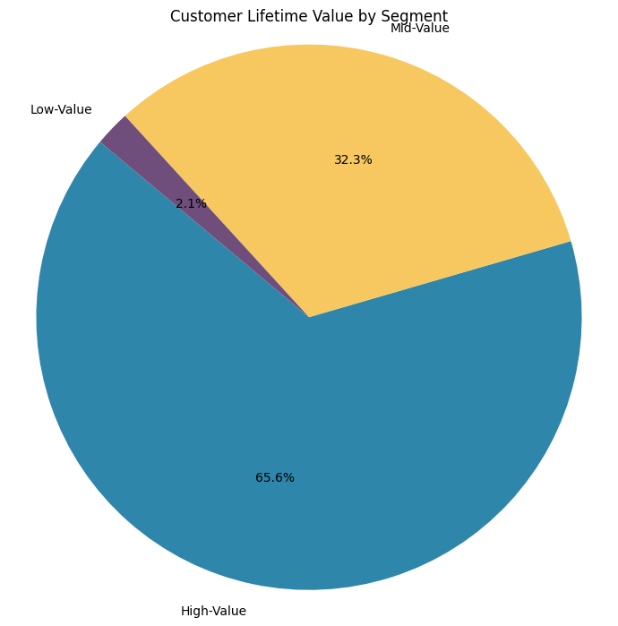
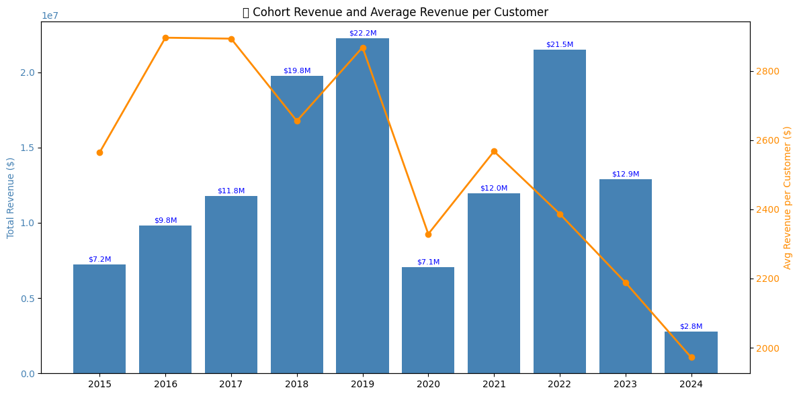
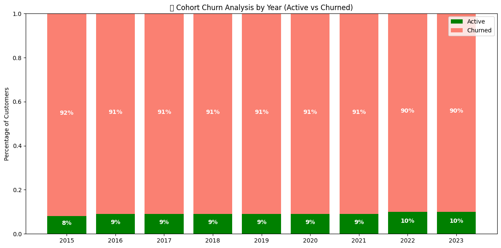

# SQL PROJECT - Sales Analysis

## Overview
Analysis of customer behavior, retention, and lifetime value for an e-commerce company to improve customer retention and maximize revenue.

## Business Questions
1. **Customer Segmentation:** Who are our most valuable customers?
2. **Cohort Analysis:** How do different customers generate revenue?
3. **Rentention Analysis:** Which customers haven't purchased recently?

## Cleaning Up the Data
- Aggregated sales and customer data into revenue metrics
- Calculated first purchase dates for cohort analysis
- Created view combining transactions and customer details

**🖥️ Query**: [0_create_view.sql](0_create_view.sql)

```sql
CREATE OR REPLACE VIEW cohort_analysis AS
WITH customer_revenue AS (
	SELECT
		s.customerkey,
		s.orderdate,
		sum(s.quantity::double PRECISION * s.netprice * s.exchangerate) AS net_revenue,
		count(s.orderkey) AS num_orders,
		MAX(c.countryfull) AS countryfull,
		MAX(c.age) AS age,
		MAX(c.givenname) AS givenname,
		MAX(c.surname) AS surname
	FROM
		sales s
	INNER JOIN customer c ON
		s.customerkey = c.customerkey
	GROUP BY
		s.customerkey,
		s.orderdate
		
)
 SELECT
	customerkey,
	orderdate,
	net_revenue,
	num_orders,
	countryfull,
	age,
	concat(TRIM(BOTH FROM givenname), ' ', TRIM(BOTH FROM surname)) AS cleaned_name,
	min(orderdate) OVER (
		PARTITION BY customerkey
	) AS first_purchase_date,
	EXTRACT(YEAR FROM min(orderdate) OVER (PARTITION BY customerkey)) AS cohort_year
FROM
	customer_revenue cr;
```


## Analysis Approach

### 1. Customer Segmentation Analysis
- Categorized customers based on total lifetime
value (LTV)
- Assigned customers to High, Mid, and Low-value segments
- Calculated key metrics: total revenue

🖥️ Query: [1_customer_segmentation.sql](/1_customer_segmentation.sql)

```sql
WITH customer_ltv AS (
	SELECT 
		customerkey,
		cleaned_name,
		SUM(net_revenue) AS total_ltv
	FROM cohort_analysis
	GROUP BY 
		customerkey,
		cleaned_name
), customer_segments AS (
	SELECT 
		PERCENTILE_CONT(0.25) WITHIN GROUP (ORDER BY total_ltv) AS ltv_25th_percentile,
		PERCENTILE_CONT(0.75) WITHIN GROUP (ORDER BY total_ltv) AS ltv_75th_percentile
	FROM customer_ltv 
), segment_values AS (
	SELECT 
		c.*,
		CASE 
			WHEN c.total_ltv < cs.ltv_25th_percentile THEN '1 - Low-Value'
			WHEN c.total_ltv <= cs.ltv_75th_percentile THEN '2 - Mid-Value'
			ELSE '3 - High-Value'
		END AS customer_segment
	FROM customer_ltv c,
		customer_segments cs
)
SELECT
	customer_segment,
	SUM(total_ltv) AS total_ltv,
	COUNT(customerkey) AS customer_count,
	SUM(total_ltv) / COUNT(customerkey) AS avg_ltv
FROM segment_values 
GROUP BY
	customer_segment 
ORDER BY 
	customer_segment DESC 
```

📈 **Visualizations:**

🐍 Analysis Notebook: [1_customer_segmentation.ipynb](analysis/1_customer_segmentation.ipynb)



📊 **Key Findings:**
- High-value segment (25% of customers) drives 66%
of revenue ($135.4M)
- Mid-value segment (50% of customers) generates
32% of revenue ($66.6M)
- Low-value segment (25% of customers) accounts for 2% of revenue ($4.3M)

💡 **Business Insights:**
- High-Value (66% revenue): Offer premium membership program to 12,372 VIP customers, as losing one customer significantly impacts revenue
- Mid-Value (32% revenue): Create upgrade paths through personalized promotions, with potential
$66.6M → $135.4M revenue opportunity
- Low-Value (2% revenue): Design re-engagement campaigns and price-sensitive promotions to increase purchase frequency

### 2. Cohort Analysis
- Tracked revenue and customer count per cohorts.
- Cohorts were grouped by year of first purchase.
- Analyzed customer retention at a cohort level.

🖥️ Query: [2_cohort_analysis.sql](/2_cohort_analysis.sql)

```sql
SELECT
	cohort_year,
	COUNT(DISTINCT customerkey) AS total_customers,
	SUM(net_revenue) AS total_revenue,
	SUM(net_revenue) / COUNT(DISTINCT customerkey) AS customer_revenue
FROM cohort_analysis 
WHERE orderdate = first_purchase_date 
GROUP BY 
	cohort_year
```
📈 **Visualizations:**

🐍 Analysis Notebook: [2_cohort_analysis.ipynb](analysis/2_cohort_analysis.ipynb)



📊 **Key Findings:**
- Revenue per customer shows an alarming decreasing trend over time.
- 2022-2024 cohorts are consistently performing worse than earlier cohorts.
- NOTE: Although net revenue is increasing, this is likely due to a larger customer base, which is not reflective of customer value.

💡 **Business Insights:**
- Value extracted from customers is decreasing over time and needs further investigation.
- In 2023 we saw a drop in number of customers acquired, which is concerning.
- With both lowering LTV and decreasing customer acquisition, the company is facing a potential revenue decline.

### 3. Retention Analysis
- Identified customers at risk of churning
- Analyzed last purchase patterns
- Calculated customer-specific metrics

🖥️ Query: [3_retention_analysis.sql](/3_retention_analysis.sql)

```sql
WITH customer_last_purchase AS (	
	SELECT
		customerkey,
		cleaned_name,
		orderdate,
		ROW_NUMBER() OVER (PARTITION BY customerkey ORDER BY orderdate DESC) AS rn,
		first_purchase_date,
		cohort_year
	FROM cohort_analysis
), churnned_customers AS (SELECT 
		customerkey,
		cleaned_name,
		orderdate AS last_purchase_date,
		CASE 
			WHEN orderdate < (SELECT MAX(orderdate) FROM sales) - INTERVAL '6 months' THEN 'Churned'
			ELSE 'Active'
		END AS customer_status,
		cohort_year
	FROM customer_last_purchase 
	WHERE 
		rn = 1 AND
		first_purchase_date  <  (SELECT MAX(orderdate) FROM sales) - INTERVAL '6 months'
)

SELECT 
	cohort_year,
	customer_status,
	COUNT(customerkey) AS num_customers,
	SUM(COUNT(customerkey)) OVER(PARTITION BY cohort_year) AS total_customers,
	ROUND(COUNT(customerkey) /  SUM(COUNT(customerkey)) OVER(PARTITION BY cohort_year), 2) AS status_percentage
FROM churnned_customers 
GROUP BY cohort_year, customer_status 

```

📈 **Visualizations:**

🐍 Analysis Notebook: [3_retention_analysis.ipynb](analysis/3_retention_analysis.ipynb)




📊 **Key Findings:**
- Cohort churn stabilizes at ~90% after 2-3 years, indicating a predictable long-term retention pattern.
- Retention rates are consistently low (8-10%) across all cohorts, suggesting retention issues are systemic rather than specific to certain years.
- Newer cohorts (2022-2023) show similar churn trajectories, signaling that without intervention, future cohorts will follow the same pattern.

💡 **Business Insights:**
- Strengthen early engagement strategies to target the first 1-2 years with onboarding incentives, loyalty rewards, and personalized offers to improve long-term retention.
- Re-engage high-value churned customers by focusing on targeted win-back campaigns rather than broad retention efforts, as reactivating valuable users may yield higher ROI.
- Predict & preempt churn risk and use customer-specific warning indicators to proactively intervene with at-risk users before they lapse.

## Strategic Rcommendations


## Technical Details
- **Database:** PostgreSQL
- **Analysis Tools:** PostgreSQL, Dbeaver, PGadmin
- **Visualization:** Colab Notebook
